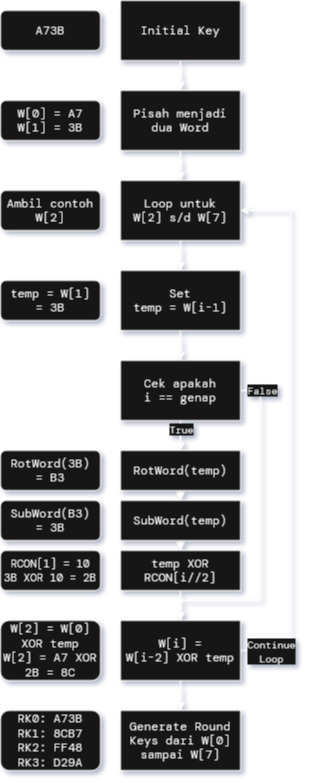
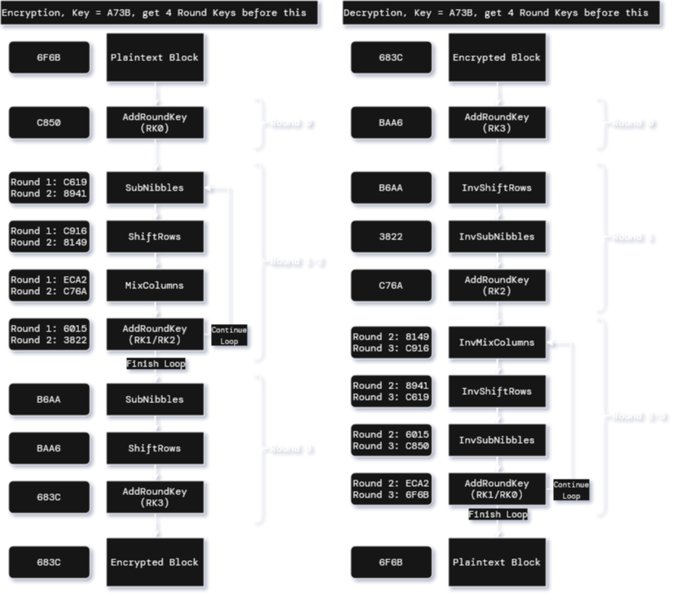
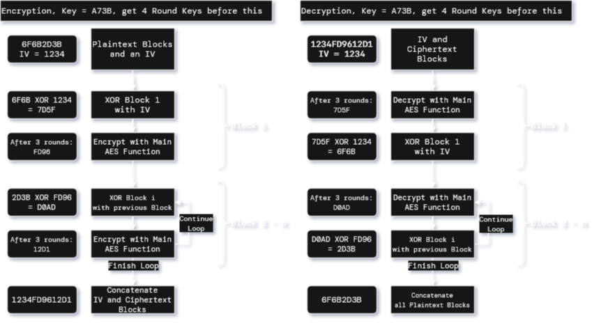

# Mini-Aes Implementation - v1 w/ Streamlit

## Kelompok

Nama | NRP
-|-
Nathan Kho Pancras | 5027231002
Amoes Noland | 5027231028
Fico Simhanandi | 5027231030
Rafi' Afnaan Fathurrahman | 5027231040
Dimas Andhika Diputra | 5027231074

## Prerequisites

* Make sure to have UV and Streamlit installed globally pada mesin anda.
* Pastikan untuk menginstal UV dan Streamlit secara global pada mesin anda.

```bash
uv sync
```

**Usage / Pemakaian**:

```bash
streamlit run app.py
```

## Dokumentasi

### Spesifikasi Algoritma Mini-AES

Implementasi Mini-AES ini mengikuti struktur dasar AES namun disederhanakan untuk blok dan kunci 16-bit.

1.  **Parameter Dasar:**
    *   **Ukuran Blok (Plaintext/Ciphertext):** 16 bit (4 nibble hexadesimal, misal "6F6B"). Setiap blok diproses secara individual oleh algoritma inti.
    *   **Ukuran Kunci:** 16 bit (4 nibble hexadesimal, misal "A73B"). Kunci yang sama digunakan untuk semua blok dalam satu pesan (dalam mode ECB atau CBC).
    *   **Jumlah Round:** 3 (`NUM_ROUNDS = 3`). Jumlah iterasi transformasi internal per blok.

2.  **Representasi Data:**
    *   Blok data 16-bit (4 nibble `N0 N1 N2 N3`) direpresentasikan secara internal sebagai matriks state 2x2 (`state_matrix`) untuk pemrosesan round:
        ```
        state_matrix = | N0  N2 |
                       | N1  N3 |
        ```
        Contoh: Plaintext `6F6B` -> `N0=6, N1=F, N2=6, N3=B` -> `[[0x6, 0x6], [0xF, 0xB]]`.

3.  **Key Expansion:**
    *   Proses menghasilkan serangkaian *round key* (RK0 hingga RK3) dari kunci 16-bit awal.
    *   Menggunakan `RotWord`, `SubWord` (dengan S_BOX), dan XOR dengan `RCON` *(Round Constants, hard-coded)* secara iteratif pada *word* (8-bit).
    *   Menghasilkan 4 buah *round key* 16-bit yang masing-masing direpresentasikan sebagai matriks 2x2.

4.  **Operasi Round:**
    Transformasi yang diterapkan secara berulang pada `state_matrix`:
    *   **`SubNibbles`:** Substitusi non-linear setiap nibble menggunakan tabel konstan `S_BOX` yang sudah ditentukan dalam kode *(hard-coded)*. Inversnya (`InvSubNibbles`) menggunakan `INV_S_BOX` untuk dekripsi.
    *   **`ShiftRows`:** Pergeseran siklik baris kedua ke kiri (menukar elemen kolom). Inversnya (`InvShiftRows`) identik untuk matriks 2x2.
    *   **`MixColumns`:** Transformasi linier yang mencampur nibble dalam setiap kolom menggunakan perkalian matriks di GF(2⁴) dengan `MIX_COL_MATRIX`. Inversnya (`InvMixColumns`) menggunakan `INV_MIX_COL_MATRIX`. Kedua tabel tersebut juga merupakan tabel konstan yang sudah ditentukan dalam kode *(hard-coded)*.
    *   **`AddRoundKey`:** Operasi XOR antara `state_matrix` dengan *round key* yang relevan.

5.  **Proses Enkripsi Inti (Per Blok):**
    *   Memiliki urutan: `AddRoundKey(RK0)` -> `[SubNibbles -> ShiftRows -> MixColumns -> AddRoundKey(RK1)]` -> `[SubNibbles -> ShiftRows -> MixColumns -> AddRoundKey(RK2)]` -> `[SubNibbles -> ShiftRows -> AddRoundKey(RK3)]`.

6.  **Proses Dekripsi Inti (Per Blok):**
    *   Merupakan invers dari proses enkripsi, menggunakan operasi invers (`InvSubNibbles`, `InvShiftRows`, `InvMixColumns`) dan urutan *round key* yang dibalik (RK3 hingga RK0).
    *   Memiliki urutan: `AddRoundKey(RK3)` -> `[InvShiftRows -> InvSubNibbles -> AddRoundKey(RK2) -> InvMixColumns]` -> `[InvShiftRows -> InvSubNibbles -> AddRoundKey(RK1) -> InvMixColumns]` -> `[InvShiftRows -> InvSubNibbles -> AddRoundKey(RK0)]`.

7.  **Mode Operasi:**
    *   **ECB (Electronic Codebook):**
        *   Mode operasi paling sederhana.
        *   Setiap blok plaintext 16-bit dienkripsi/didekripsi secara independen menggunakan fungsi enkripsi/dekripsi inti sesuai dengan *Proses Enkripsi/Dekripsi Inti* yang sudah disebutkan, dengan kunci yang sama.
        *   Tidak memerlukan IV.

    *   **CBC (Cipher Block Chaining):**
        *   Mode operasi yang lebih aman, menyembunyikan pola plaintext.
        *   Membutuhkan *Initialization Vector* (IV) 16-bit yang unik (idealnya acak) untuk setiap pesan. Bisa juga dimasukkan IV secara fixed/manual dalam program untuk demonstrasi khusus.
        *   **Enkripsi CBC:**
            1.  Blok plaintext pertama (P1) di-XOR dengan IV.
            2.  Hasil XOR dienkripsi menggunakan algoritma inti untuk menghasilkan blok ciphertext pertama (C1).
            3.  Blok plaintext berikutnya (Pi) di-XOR dengan blok ciphertext sebelumnya (C[i-1]).
            4.  Hasil XOR dienkripsi untuk menghasilkan Ci.
            5.  Proses berlanjut untuk semua blok.
            6.  Output akhir adalah IV diikuti oleh semua blok ciphertext (`IV || C1 || C2 || ... || Cn`).
        *   **Dekripsi CBC:**
            1.  IV diekstrak dari awal ciphertext.
            2.  Blok ciphertext pertama (C1) didekripsi menggunakan algoritma inti.
            3.  Hasil dekripsi di-XOR dengan IV untuk mendapatkan blok plaintext pertama (P1).
            4.  Blok ciphertext berikutnya (Ci) didekripsi menggunakan algoritma inti lagi.
            5.  Hasil dekripsi di-XOR dengan blok ciphertext sebelumnya (C[i-1]) untuk mendapatkan Pi.
            6.  Proses berlanjut untuk semua blok.
            7.  Output akhir adalah gabungan semua blok plaintext (`P1 || P2 || ... || Pn`).

### Flowchart
#### Alur Key Expansion



#### Alur Mini-AES

##### Algoritma ECB (Inti)



##### Algoritma CBC



### Implementasi Program

Mini-AES 16-bit ini diimplementasikan melalui sebuah GUI web-based yang menggunakan Streamlit. Fitur-fitur yang tersedia meliputi:

*   **Input dan Output:**
    *   **Input Pengguna:** Plaintext/Ciphertext dan Key dimasukkan oleh pengguna melalui text input pada interface Streamlit. Input diharapkan dalam format string heksadesimal. Panjang Key divalidasi harus 4 karakter hex (16-bit). Untuk mode CBC, input IV (juga 4 hex char) disediakan.
    *   **Proses Internal:** String heksadesimal input dikonversi menjadi daftar *nibble* (integer 0-15) sebelum diproses oleh algoritma inti.
    *   **Output Hasil:** Hasil akhir (Ciphertext untuk enkripsi, Plaintext untuk dekripsi) ditampilkan kembali sebagai string hex dalam codeblock.
    *   **Output Proses Round:** Setiap fungsi utama (`key_expansion`, `encrypt`, `decrypt`, `encrypt_cbc`, `decrypt_cbc` di `mini_aes.py`) menghasilkan *log* berupa list string yang merinci setiap langkah transformasi (misalnya, hasil `SubNibbles`, `ShiftRows`, `MixColumns`, `AddRoundKey` per round, serta langkah Key Expansion seperti `RotWord`, `SubWord`, XOR dengan `RCON`). Log ini ditampilkan di GUI dalam bagian "Show detailed process log", yang memungkinkan pengguna untuk memeriksa jalannya algoritma secara detail.

*   **Test Case:**
    *   Beberapa contoh test case (termasuk standar 6F6B/A73B, input nol, input FFFF, dan contoh multi-blok CBC) didefinisikan dalam list `TEST_CASES` di `app.py`.
    *   Pengguna dapat memilih test case dari selection box yang ditampilkan dan memasukkannya ke field input menggunakan tombol "Apply Selected Test Case".
    *   Meskipun *expected output* tidak ditampilkan langsung di UI, kebenaran implementasi bisa diverifikasi dengan menjalankan enkripsi lalu dekripsi pada test case yang sama dan memastikan plaintext asli diperoleh kembali.

*   **Antarmuka Pengguna (GUI):**
    *   Antarmuka dibangun menggunakan **Streamlit**, menyediakan pengalaman interaktif berbasis web.
    *   Komponen utama GUI meliputi:
        *   Pilihan mode operasi (Radio button untuk "Encrypt"/"Decrypt").
        *   Pilihan mode cipher (Radio button untuk "ECB"/"CBC").
        *   Field input teks untuk Plaintext/Ciphertext, Key, dan IV (hanya muncul saat CBC dipilih).
        *   Tombol "Process" untuk memulai operasi.
        *   Area output untuk menampilkan hasil dan log proses terperinci (dalam *expander*).
        *   Dropdown dan tombol untuk memilih dan menerapkan test case.
        *   Tabulasi untuk memisahkan fungsionalitas utama dengan fitur Ekspor/Impor.

*   **Mode Operasi Blok:**
    *   **ECB (Electronic Codebook):**
        *   Dipilih via radio button "ECB".
        *   Input (Plaintext/Ciphertext) yang lebih panjang dari 16-bit (4 hex char) secara otomatis dibagi menjadi blok-blok 16-bit. Setiap blok dienkripsi/didekripsi secara independen menggunakan fungsi inti dengan kunci yang sama. Fungsi pembungkus `encrypt`/`decrypt` menangani pembagian blok ini.
        *   Tidak memerlukan IV.
        
    *   **CBC (Cipher Block Chaining):**
        *   Dipilih via radio button "CBC".
        *   Membutuhkan IV 16-bit. Jika input IV kosong saat enkripsi, IV digenerate secara acak dan ditampilkan.
        *   **Enkripsi:** Blok plaintext pertama di-XOR dengan IV sebelum enkripsi inti. Blok plaintext selanjutnya di-XOR dengan blok *ciphertext* sebelumnya sebelum dienkripsi. IV asli ditambahkan di awal output ciphertext akhir.
        *   **Dekripsi:** IV diekstrak dari 4 karakter hex pertama input ciphertext. Blok ciphertext pertama didekripsi, lalu hasilnya di-XOR dengan IV. Blok ciphertext selanjutnya didekripsi, lalu hasilnya di-XOR dengan blok *ciphertext* sebelumnya.

*   **Export dan Import File:**
    *   **Export:**
        *   Diakses melalui tab "Export".
        *   Setelah operasi selesai, pengguna dapat menyimpan detail (Mode Operasi, Mode Cipher, Input, Key, IV (jika CBC), Output, dan Log Proses Lengkap) ke dalam file CSV.
        *   File disimpan di direktori `logs/` dengan nama file berdasarkan timestamp atau input pengguna. Sebuah tombol download juga disediakan pada GUI.
    *   **Import:**
        *   Diakses melalui tab "Import".
        *   Pengguna dapat mengunggah file CSV yang sebelumnya diekspor.
        *   Data yang diimpor (Input, Key, IV, dll.) ditampilkan, dan tombol "Apply imported values" memungkinkan pengguna mengisi field input utama aplikasi dengan nilai-nilai tersebut untuk dianalisis atau diproses ulang.
           
### Penjelasan Testcase
(WIP)

### Analisis
#### Kelebihan Mini-AES
(WIP)
#### Keterbatasan Mini-AES
(WIP)
#### Keamanan dan Avalanche Effect
(WIP)